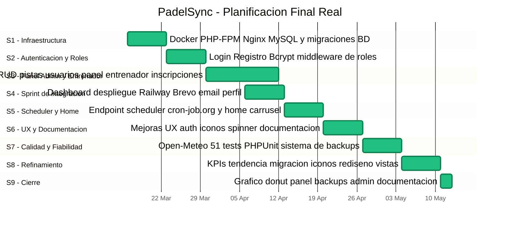
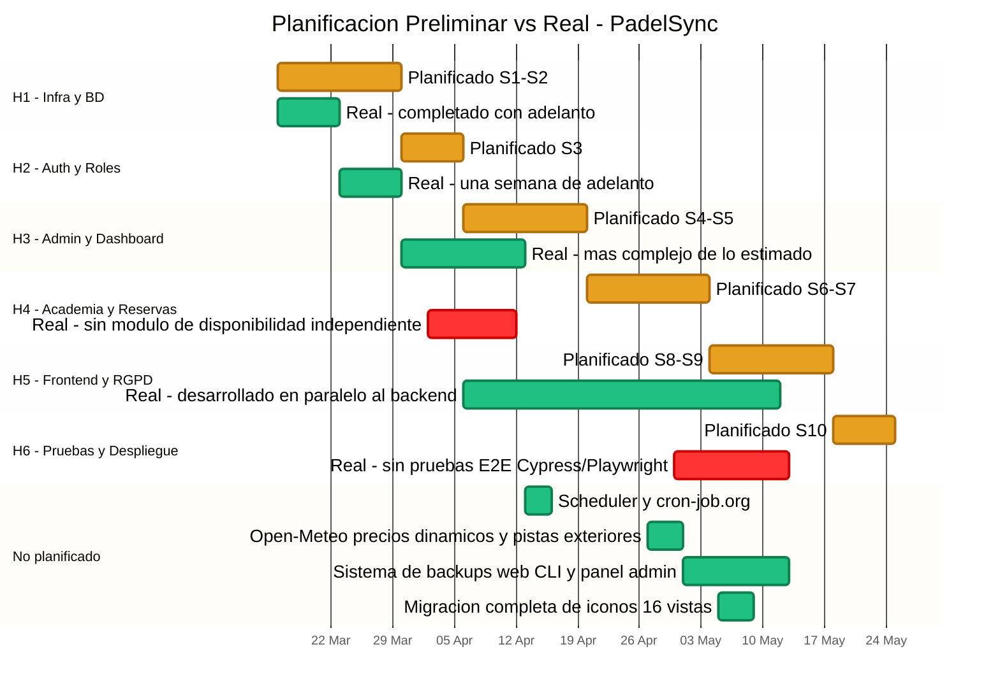

# Planificación, Comparativa y Lecciones Aprendidas — PadelSync

---

## 1. Planificación final real

El desarrollo arrancó el **16 de marzo de 2026** y se cerró el **12 de mayo de 2026**:
**8 semanas efectivas** frente a las 10 semanas estimadas en la planificación preliminar.

---

## 2. Comparación con la planificación preliminar

La planificación preliminar estaba estructurada en 6 hitos agrupados en 10 semanas.
El siguiente diagrama enfrenta lo planificado con lo ejecutado para cada hito:
las barras en naranja representan la estimación original y las barras en verde la ejecución real.
Las barras en rojo indican hitos con desviación significativa o alcance no completado.

### Análisis de coherencia y causas de las desviaciones

**Grado de coherencia global: alto en el qué, bajo en el cómo y el cuándo.**

El 90 % de los requisitos funcionales definidos en la Entrega 2 se entregaron.
Las causas de las desviaciones se agrupan en cuatro categorías:

**1. Subestimación del coste de la interfaz y la UX**

La planificación preliminar dedicaba las semanas 8–9 exclusivamente al frontend, asumiendo
que era una capa que se añadiría al final. En la práctica, cada funcionalidad de backend
requería su vista correspondiente de forma inmediata para poder probarse, lo que hizo que
frontend y backend se desarrollaran siempre en paralelo. Esto explica el sprint mayor de la
semana 4, donde se entregaron simultáneamente backend y frontend de casi todas las
funcionalidades del sistema.

**2. Restricciones no previstas de la plataforma de producción (Railway)**

La planificación no contemplaba las limitaciones específicas de Railway: bloqueo de puertos
SMTP, filesystem efímero, ausencia de cron nativo, imposibilidad de ejecutar comandos
remotos con `railway run`. Cada restricción requirió una solución alternativa no planificada:

- Brevo HTTP transport → sustituyó al SMTP estándar
- cron-job.org + endpoint protegido → sustituyó al cron nativo
- `db:backup` en PHP puro → sustituyó a `mysqldump`
- Panel web de backups → sustituyó al acceso por CLI

**3. Scope creep controlado**

La integración de Open-Meteo (tarifa nocturna dinámica, bloqueo de pistas exteriores por
lluvia) y el panel web de backups no estaban en el plan inicial, pero fueron implementados como
respuesta a necesidades reales detectadas durante el desarrollo. Ambas funcionalidades
añaden valor diferencial pero supusieron tiempo no planificado.

**4. Las pruebas E2E no se ejecutaron**

El plan incluía Cypress o Playwright para pruebas de extremo a extremo. En la práctica, la
suite de PHPUnit con 51 tests cubrió los flujos críticos y el checklist de pruebas manuales
cubrió los casos visuales y JavaScript. Cypress no se instaló por no justificar el coste de
configuración para el alcance de un proyecto individual.

---

## 3. Lecciones aprendidas

### 3.1 Qué se hizo bien y repetiría

**Bitácora técnica desde el primer día.**
Documentar cada problema con su causa, solución y lección aprendida en el momento en que
ocurre es la práctica de mayor valor de todo el proyecto. Al llegar a la semana 7, fue posible
reconstruir exactamente qué decisiones se tomaron y por qué sin depender de la memoria.
Para un proyecto en solitario, la bitácora sustituye a las revisiones de código del equipo.

**Iteraciones cortas backend + frontend.**
Desarrollar cada funcionalidad de principio a fin (modelo → controlador → vista) en la misma
sesión evitó el riesgo de encontrar incompatibilidades entre capas al final. El sprint de la
semana 4 demostró que este enfoque funciona incluso en periodos de alta densidad.

**Caché local para APIs externas.**
El patrón `weather_cache` (tabla de un registro por día, rellenada por un comando programado,
consultada por los controladores sin llamadas en tiempo real) es el correcto para cualquier
API de terceros: cero latencia en las vistas, datos actualizados una vez al día y fallback
automático si la API falla. Se aplicaría igual en una versión 2.

**Git como única fuente de verdad del código.**
Nunca se perdió trabajo. Cada `push` fue el backup del código. La lección del Hito 12
(warnings de `mysqldump` en stdout) reforzó por qué los backups del código y los de datos
son problemas distintos que no deben mezclarse.

**Separación de `env()` y `config()` desde el inicio.**
Migrar `env('CRON_SECRET')` a `config('padelsync.cron_secret')` fue un cambio pequeño que
resolvió un problema de tests y además es la práctica correcta en Laravel. Se aplicaría esta
separación desde el primer archivo de configuración en cualquier proyecto siguiente.

---

### 3.2 Errores que no volvería a cometer

**No hacer ninguna planificación al inicio.**
El proyecto arrancó directamente con código sin definir estructura, prioridades ni estimaciones.
Eso derivó en la semana 3 sin commits, en el scope creep de Open-Meteo y el panel de
backups, y en las pruebas E2E que quedaron sin implementar. Una planificación ligera de dos
horas al inicio habría detectado las restricciones de Railway antes del despliegue y habría
distribuido el trabajo de forma más uniforme.

**Dejar los tests para el final.**
En la semana 7 los tests revelaron 6 incidencias que requirieron modificar código de
producción ya desplegado (`UserFactory`, enum de estados, configuración del endpoint del
scheduler). Si los tests se hubieran escrito en paralelo con el código, estas incidencias se
habrían detectado y resuelto al momento, con un coste mucho menor. Escribir el test en el
mismo momento en que se escribe el controlador es la única forma de que los tests sean
útiles preventivamente.

**Mezclar tres fuentes de iconos sin establecer una convención desde el inicio.**
La semana 8 se dedicó en gran parte a la migración completa de iconos (16 vistas), un trabajo
puramente correctivo que no aportó ninguna funcionalidad nueva. Si desde la primera vista se
hubiera establecido la convención de usar iconify-icon/Phosphor, esa semana entera habría
estado disponible para otras tareas.

**No usar una rama `develop` a pesar de tenerlo planificado.**
Todos los commits fueron directamente a `master`, incluyendo fixes urgentes de producción
mezclados con desarrollo de nuevas funcionalidades. En el próximo proyecto: `master` solo
para versiones estables; `develop` para el trabajo diario.

---

### 3.3 Tres mejoras para una versión 2

**Mejora 1 — Introducir una capa de servicios (Service Layer)**

En la versión actual, los controladores contienen lógica de negocio compleja: el
`ReservationController` valida la disponibilidad horaria, consulta el tiempo, calcula la tarifa
y guarda la reserva en el mismo método. En una v2, toda esa lógica se extraería a clases de
servicio (`ReservationService`, `PricingService`, `WeatherService`). Los controladores
quedarían con una sola responsabilidad: recibir la petición, delegar en el servicio y devolver
la respuesta. Esto haría los tests unitarios triviales, el código más legible y el mantenimiento
más sencillo.

**Mejora 2 — Pagos reales con Stripe o similar**

La tarifa de reservas se calcula (12 € / 16 €) y se registra en base de datos, pero el pago es
completamente manual: el admin o el scheduler marcan la reserva como `paid` sin que haya
ninguna transacción real. En una v2, integrar Stripe Checkout añadiría el flujo completo: el
jugador paga al reservar, se genera un recibo, el admin ve los ingresos reales verificados.
Esto convertiría PadelSync en un sistema operativo real y no solo de gestión.

**Mejora 3 — Persistencia de backups en almacenamiento externo**

El sistema actual de backups es local al contenedor de Railway, que es efímero: si el
contenedor se reinicia, los backups se pierden. En una v2 se integraría el almacenamiento de
backups en un servicio de objeto externo (Cloudflare R2, AWS S3 o similar): el comando
`db:backup` generaría el `.sql` y lo subiría al bucket; el `BackupController` listaría y
restauraría desde ahí. Esto resolvería definitivamente la limitación documentada en el Hito 25
y haría el sistema de backups fiable en producción.